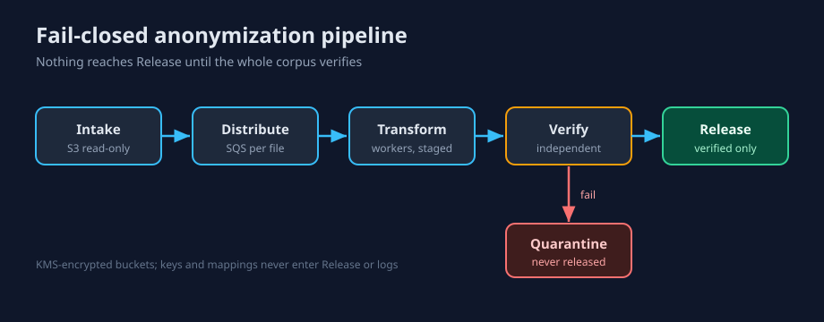

# Architecture

Skimmable design map for a walkthrough — readable without opening the source.

## 1. Problem in one paragraph
Replace every value an authoritative `policy.json` marks sensitive, across CSV,
JSON, UTF-8 text, and SQLite, while preserving structure, protected values, and
identity coherence — then verify the whole corpus and publish only if it passes,
fail-closed. Out of scope: discovering unlisted PII, and resistance to
re-identification (see `PRIVACY_CONTRACT.md`).

## 2. Design principles
Deterministic · identity-coherent · fail-closed · independently verified ·
report-last publication · per-file processing (not TB-scale streaming) · no raw/mapping leakage.

## 3. System at a glance


The one idea to remember: **the transformer cannot certify itself.**
```
TRANSFORMER -> PRIVATE STAGING -> (source reread + output reread)
            -> INDEPENDENT VERIFIER -> PASS ? PUBLISH : DISCARD -> report.json LAST
```

## 4. Trust boundaries
Trusted-but-untrusted input mount → private same-filesystem staging → verified →
releasable output. Input contents/paths/encodings are attacker-controlled;
staging is never consumer-visible; release appears only after verification.

## 5. Policy & identity model
`(data_type, subject_id)` is the canonical identity (`policy.py`,
`pseudonyms.py`). Aliases converge; distinct same-type identities are injective;
collision search stays within bounded domains and rejects exhaustion; protected/sensitive overlap is
rejected at compile time.

## 6. Matching semantics (`matcher.py`)
Aho-Corasick over **original input only**; leftmost-longest with stable
`rule_id` tie-break; emitted replacements are never rescanned (no cascade).
UTF-8/BOM preserved; no normalization; non-ASCII case-insensitive rejected.

## 7. Format adapters (`formats.py`)
| Format | What changes | What must not | Reject |
|---|---|---|---|
| Text | selected spans | bytes outside spans, BOM, newlines | malformed UTF-8 |
| CSV | data cells; quoting normalized | logical header, row/cell order, newline style, BOM | sensitive header, malformed quoting, unquoted semicolon/tab/pipe |
| JSON | string values | keys, order, scalar types/numbers | dup keys, NaN, sensitive key, over-depth |
| SQLite | text values | schema, PK/FK, row counts, non-text | virtual/WITHOUT ROWID, sensitive identifier |

## 8. Independent verification (`verification.py`)
Rereads source + staged output from disk (not transform booleans): file-set
parity, no surviving literal, protected-count parity, subject-level presence,
and a value-level text skeleton (catches swapped/wrong pseudonyms). CSV/JSON
values are recomputed per location; SQLite adds a typed per-row oracle by rowid
to integrity, foreign-key, and row-count checks.

## 9. Publication & crash recovery (`pipeline.py`)
```
preflight -> source frozen (digests) -> compiled -> staged -> verified
-> source unchanged? -> corpus published -> report.json LAST -> READY
```
Every failure arrow → FAILED / QUARANTINED / UNCOMMITTED; a prior valid release
is never mutated until publish succeeds.

## 10. Security & privacy
Closed error vocabulary (`errors.py`) never echoes raw data; no mapping/key in
release or logs; source-snapshot/TOCTOU gate. Threat model: `security/THREAT_MODEL.md`.

## 11. Performance model
Per-file processing (CSV rows are iterated, but file content, matches, and
verifier text are materialized in memory — not TB-scale streaming; see
SUBMISSION production-hardening boundary). SQLite uses an online-backup snapshot; JSON is bounded
by depth/size limits. The demo measures per-run peak RSS across a 10× size step.

## 12. Production architecture
AWS reference + 1 TB/1 PB cost: `production-architecture.md`. Portability
contract + AWS/GCP/Azure mapping: `../infra/`.

## 13. What this proves / does not prove
Proves declared-literal replacement, identity coherence, protected preservation,
structural invariants, verified fail-closed release. Does **not** prove unlisted-PII
discovery, external-linkage resistance, or formal anonymity (`PRIVACY_CONTRACT.md`;
machine-readable `does_not_establish` in `report.json`).

## Design → failure → proof (examples)
| Invariant | Failure example | Evidence |
|---|---|---|
| No ready release before full verification | crash after transform, before verify | `tests/test_pipeline_failclosed.py` |
| Transformer can't self-certify | swapped pseudonyms in output | `tests/test_verifier_sensitivity.py::test_swapped_subject_pseudonyms_is_caught` |
| Source can't change under us | mtime-preserved content change | `tests/test_source_snapshot.py` |
| No partial/leaky release via CLI | hostile mounted corpus | `tests/test_blackbox_contract.py` |
