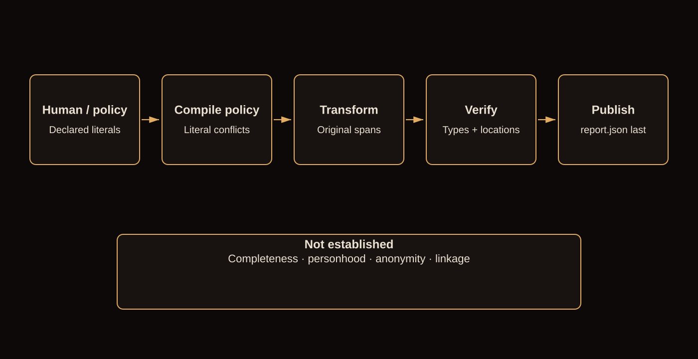
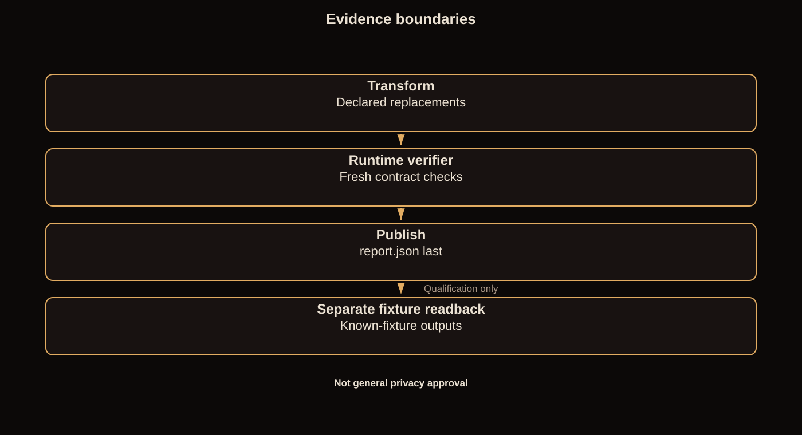

# Code-assisted walkthrough

**Canonical explanatory narrative.** The slide deck compresses this explanation; the code supplies implementation evidence. The speaker walkthrough remains the timed rehearsal script, not a competing technical contract. Adapted from the human-supplied WebGPT report; code blocks below are exact excerpts from the unchanged runtime/qualification source, not rewritten pseudocode.

[Slide-by-slide script](WALKTHROUGH.md) · [Reviewer questions](https://github.com/grahama1970/oai-trial/blob/main/docs/DESIGN_DECISIONS_AND_LIMITATIONS.md) · [Mock interviews](https://github.com/grahama1970/oai-trial/blob/main/docs/MOCK_INTERVIEWS.md)

Terminology: **literal-policy conflict**, **policy-declared identity**, **declared-identity coherence**, **alias candidate generation**, **fresh reread with shared primitives**, **technically READY under the declared transformation contract**. These terms deliberately exclude broader semantic claims.

<a id="challenge"></a>
## The challenge and its boundary

The third slide maps the original brief to four delivered groups: four-format transformation; consistency and preservation; reproducible Docker execution; and production architecture/cost modeling. Check marks denote supplied mechanisms and evidence, not exhaustive correctness. Deployment was not required. Recorded small-workload measurements remain supporting evidence.



**Slides:** `r02-demo-result`, `r03-demo-observations`, `r07-pipeline-map`

Replace policy-declared sensitive literals across CSV, JSON, UTF-8 text and SQLite while preserving explicitly protected values and supported structure. The program checks a narrow transformation contract; it does not understand privacy semantically. A successful synthetic demonstration is evidence for its exercised cases, not universal correctness.

**Code:** [src/anonymization_trial/pipeline.py::run_pipeline, lines 214–281](https://github.com/grahama1970/oai-trial/blob/0375af56bf681e9441edcb7433cfe58951db77b2/src/anonymization_trial/pipeline.py#L214-L281)

```python
def run_pipeline(input_root: Path, output_root: Path) -> RunReport:
    started = time.perf_counter()
    # mkdtemp returns an absolute path; use the same form during publication
    # so a relative output does not cause the cleanup loop to delete its stage.
    output_root = output_root.absolute()
    # Reject an unsafe policy path BEFORE reading/following it, so an untrusted
    # policy.json symlink is never opened (review #policy-preflight-before-read).
    policy_file = input_root / "policy.json"
    if policy_file.is_symlink() or not policy_file.is_file():
        _reject(AnonErrorCode.UNSAFE_INPUT, "input bundle must contain a regular policy.json")
    policy = load_policy(policy_file)
    files = _preflight(input_root, output_root, policy)

    inventory = _source_digests(files)
    output_root.mkdir(parents=True, exist_ok=True)
    # Remove any crashed run's staging tree before creating our own, so a stale
    # half-written stage can never be published (review #6). Staging stays on the
    # output filesystem because the corpus promote is an atomic same-fs rename;
    # it is created private (0700) to limit host-reader exposure.
    _clean_stale_stages(output_root)
    staging = Path(tempfile.mkdtemp(dir=output_root, prefix=".staging-"))
    os.chmod(staging, 0o700)
    try:
        staged_corpus = staging / "corpus"
        staged_corpus.mkdir()
        records = replacements = bytes_read = 0
        for source, relative in files:
            file_records, file_replacements = transform_file(
                source, staged_corpus / relative, policy
            )
            records += file_records
            replacements += file_replacements
            bytes_read += source.stat().st_size

        verify_corpus(input_root / "corpus", staged_corpus, policy)
        # Source-snapshot / TOCTOU gate: reject if any source file changed between
        # inventory and this point (detects content mutation even if mtime is
        # preserved). Publishing a corpus derived from a mutated source is unsafe.
        if _source_digests(files) != inventory:
            _reject(AnonErrorCode.SOURCE_CHANGED, "a source file changed during processing")
        # Seal the verified bytes: the digest computed HERE (right after verify +
        # TOCTOU) is what _publish re-checks immediately before the swap, binding
        # "verified" to "published" (review #4).
        sealed_digest = _manifest_digest(staged_corpus)
        source_manifest_sha256 = _source_manifest_digest(inventory)
        policy_sha256 = hashlib.sha256((input_root / "policy.json").read_bytes()).hexdigest()
        bytes_written = sum(p.stat().st_size for p in staged_corpus.rglob("*") if p.is_file())
        report = RunReport(
            status="ready",
            files_processed=len(files),
            records_processed=records,
            bytes_read=bytes_read,
            bytes_written=bytes_written,
            replacements_applied=replacements,
            verification_passed=True,
            elapsed_seconds=round(time.perf_counter() - started, 6),
            policy_sha256=policy_sha256,
            corpus_manifest_sha256=sealed_digest,
            run_id=hashlib.sha256(
                f"{policy_sha256}:{source_manifest_sha256}:{time.time_ns()}".encode()
            ).hexdigest(),
            source_manifest_sha256=source_manifest_sha256,
            verification_sha256=sealed_digest,
        )
        _publish(staging, output_root, report, sealed_digest)
        return report
    finally:
        shutil.rmtree(staging, ignore_errors=True)
```

<a id="policy"></a>
## Humans supply meaning; code enforces literal rules

**Slides:** `r08-policy`, `r18-question-exact`, `r19-answer-exact`

The policy supplies sensitive literals, protected values and alias identities. Alice and A.L refer to one person only because a human supplied that declaration. KEEP is a synthetic protected literal, not an English command the software understands. PII means personally identifiable information; the engine does not discover all PII.

If Alice is both sensitive and protected, replacement and preservation are mechanically incompatible. The compiler rejects equality, containment and conservative boundary overlaps, with the declared case behavior. It cannot recognize that Graham Anderson and the candidate from Buffalo refer to the same person.

**The compiler rejects literal-policy conflicts, not semantic contradictions.**

**Code:** [src/anonymization_trial/policy.py::_check_overlap, lines 111–126](https://github.com/grahama1970/oai-trial/blob/0375af56bf681e9441edcb7433cfe58951db77b2/src/anonymization_trial/policy.py#L111-L126)

```python
def _check_overlap(rules: tuple[Rule, ...], protected: tuple[str, ...]) -> None:
    for rule in rules:
        sv = rule.value
        for pv in protected:
            a, b = (ascii_lower(sv), ascii_lower(pv)) if not rule.case_sensitive else (sv, pv)
            if (
                a == b
                or a in b
                or b in a
                or _boundary_overlap(a, b)
                or _boundary_overlap(b, a)
            ):
                raise AnonError(
                    AnonErrorCode.PROTECTED_SENSITIVE_OVERLAP,
                    f"sensitive rule {safe_ref(rule.rule_id)} overlaps a protected value",
                )
```

**Code:** [src/anonymization_trial/policy.py::compile_policy, lines 129–253](https://github.com/grahama1970/oai-trial/blob/0375af56bf681e9441edcb7433cfe58951db77b2/src/anonymization_trial/policy.py#L129-L253)

```python
def compile_policy(payload: object) -> Policy:
    """Validate a policy payload strictly and compile its matcher."""
    _require(isinstance(payload, dict), AnonErrorCode.INVALID_POLICY, "policy is not an object")
    version = payload.get("version")
    # `True == 1` in Python, so a bool must be rejected explicitly before the
    # value comparison, or `"version": true` would pass as version 1.
    _require(
        isinstance(version, int) and not isinstance(version, bool) and version == 1,
        AnonErrorCode.INVALID_POLICY,
        "unsupported policy version",
    )
    _require(
        set(payload) <= _ALLOWED_TOP_KEYS,
        AnonErrorCode.INVALID_POLICY,
        "policy has unknown top-level fields",
    )
    # Both arrays are REQUIRED by examples/policy.schema.json. Defaulting a
    # missing sensitive_values to [] would turn a schema-invalid policy into a
    # successful no-op that publishes the untouched corpus READY (review #16/#2).
    _require(
        "sensitive_values" in payload,
        AnonErrorCode.INVALID_POLICY,
        "sensitive_values is required",
    )
    _require(
        "protected_values" in payload,
        AnonErrorCode.INVALID_POLICY,
        "protected_values is required",
    )
    raw_sensitive = payload["sensitive_values"]
    raw_protected = payload["protected_values"]
    _require(
        isinstance(raw_sensitive, list),
        AnonErrorCode.INVALID_POLICY,
        "sensitive_values must be an array",
    )
    _require(
        isinstance(raw_protected, list),
        AnonErrorCode.INVALID_POLICY,
        "protected_values must be an array",
    )

    rules: list[Rule] = []
    seen_ids: set[str] = set()
    for index, item in enumerate(raw_sensitive):
        rule = _rule_from(item, index)
        _require(
            rule.rule_id not in seen_ids,
            AnonErrorCode.DUPLICATE_RULE_ID,
            f"duplicate rule_id {safe_ref(rule.rule_id)}",
        )
        seen_ids.add(rule.rule_id)
        if not rule.case_sensitive:
            _require(
                rule.value.isascii(),
                AnonErrorCode.NON_ASCII_INSENSITIVE,
                f"rule {safe_ref(rule.rule_id)} is case-insensitive but not ASCII",
            )
        rules.append(rule)

    protected: list[str] = []
    for index, item in enumerate(raw_protected):
        _require(
            isinstance(item, dict),
            AnonErrorCode.INVALID_POLICY,
            f"protected_values[{index}] not an object",
        )
        _require(
            set(item) <= _ALLOWED_PROTECTED_KEYS,
            AnonErrorCode.INVALID_POLICY,
            f"protected_values[{index}] unknown fields",
        )
        value = item.get("value")
        _require(
            isinstance(value, str) and value != "",
            AnonErrorCode.INVALID_POLICY,
            f"protected_values[{index}].value invalid",
        )
        if "reason" in item:
            _require(
                isinstance(item["reason"], str) and item["reason"] != "",
                AnonErrorCode.INVALID_POLICY,
                f"protected_values[{index}].reason must be a non-empty string",
            )
        protected.append(value)

    # One source text must not map to conflicting identities. Conflict is judged
    # over each rule's MATCH DOMAIN, not its exact literal: two case-insensitive
    # rules 'Alice' and 'ALICE' both match the input 'alice', so keying only the
    # exact spelling would let them claim the same text for different subjects.
    # Group by case-folded value; within a group, two rules with different
    # identities conflict unless BOTH are case-sensitive with differing exact
    # spellings (their match sets are then disjoint).
    domain: dict[str, list[Rule]] = {}
    for rule in rules:
        key = ascii_lower(rule.value)
        for prior in domain.get(key, ()):
            if prior.identity == rule.identity:
                continue
            both_cs = rule.case_sensitive and prior.case_sensitive
            if not both_cs or prior.value == rule.value:
                raise AnonError(
                    AnonErrorCode.IDENTITY_CONFLICT,
                    f"rule {safe_ref(rule.rule_id)} shares a match domain with a conflict",
                )
        domain.setdefault(key, []).append(rule)

    rules_tuple = tuple(rules)
    protected_tuple = tuple(protected)
    _check_overlap(rules_tuple, protected_tuple)

    identities: list[CanonicalIdentity] = [rule.identity for rule in rules_tuple]
    replacements = build_replacements(identities, 1)
    rules_cs: list[tuple[str, str, str]] = []
    rules_ci: list[tuple[str, str, str]] = []
    for rule in rules_tuple:
        triple = (rule.value, replacements[rule.identity], rule.rule_id)
        (rules_cs if rule.case_sensitive else rules_ci).append(triple)

    return Policy(
        version=1,
        rules=rules_tuple,
        protected_values=protected_tuple,
        matcher=build_matcher(rules_cs, rules_ci),
    )
```

<a id="identity"></a>
## Policy-declared identity, not inferred personhood

**Slides:** `r09-identity`

Aliases share the canonical key supplied by the policy: data type plus subject ID, or rule ID when no subject is supplied. This is policy-declared identity, not inferred personhood. A mistaken human identity assignment can be reproduced consistently.

Pseudonyms use a public, unkeyed SHA-256 namespace with explicit algorithm, scope, policy version, type, identity and salt inputs. Algorithm/scope labels participate in the digest; KEY_MODE is descriptive metadata. Deterministic does not mean secret. HMAC and managed key rotation remain proposed production work.

Collision allocation processes sorted identities and retries within fixed domains. Distinct identities of the same type receive distinct replacements or reject. Stability assumes the same relevant identity set; workers seeing different subsets need a shared allocation plan, not merely a shared key.

**Code:** [src/anonymization_trial/policy.py::Rule.identity, lines 38–40](https://github.com/grahama1970/oai-trial/blob/0375af56bf681e9441edcb7433cfe58951db77b2/src/anonymization_trial/policy.py#L38-L40)

```python
    @property
    def identity(self) -> CanonicalIdentity:
        return (self.data_type, self.subject_id or self.rule_id)
```

**Code:** [src/anonymization_trial/pseudonyms.py::_digest, lines 41–43](https://github.com/grahama1970/oai-trial/blob/0375af56bf681e9441edcb7433cfe58951db77b2/src/anonymization_trial/pseudonyms.py#L41-L43)

```python
def _digest(policy_version: int, data_type: str, identity: str, salt: int) -> str:
    material = f"{ALGORITHM_VERSION}:{SCOPE_ID}:{policy_version}:{data_type}:{identity}:{salt}"
    return hashlib.sha256(material.encode("utf-8")).hexdigest()
```

**Code:** [src/anonymization_trial/pseudonyms.py::build_replacements, lines 62–104](https://github.com/grahama1970/oai-trial/blob/0375af56bf681e9441edcb7433cfe58951db77b2/src/anonymization_trial/pseudonyms.py#L62-L104)

```python
def build_replacements(
    identities: list[CanonicalIdentity], policy_version: int
) -> dict[CanonicalIdentity, str]:
    """Return a stable, per-type-distinct replacement for each identity.

    Identities are processed in sorted order so the plan is independent of input
    order. On a collision within a bounded domain, the salt is incremented
    deterministically until the replacement is unique for that data type.
    """
    unique = sorted(set(identities))
    # Cardinality preflight: reject over-capacity bounded types up front.
    counts: dict[str, int] = {}
    for data_type, _identity in unique:
        counts[data_type] = counts.get(data_type, 0) + 1
    for data_type, capacity in _DOMAIN_CAPACITY.items():
        if counts.get(data_type, 0) > capacity:
            raise AnonError(
                AnonErrorCode.NAMESPACE_EXHAUSTED,
                f"data_type={safe_ref(data_type)} has {counts[data_type]} identities but its "
                f"bounded domain holds at most {capacity}",
            )

    replacements: dict[CanonicalIdentity, str] = {}
    used_by_type: dict[str, set[str]] = {}
    for data_type, identity in unique:
        seen = used_by_type.setdefault(data_type, set())
        # Bound the collision search to the domain capacity so it can never spin
        # far beyond the number of distinct values the domain can hold.
        attempt_cap = _DOMAIN_CAPACITY.get(data_type, 100_000)
        salt = 0
        while True:
            candidate = _render(data_type, _digest(policy_version, data_type, identity, salt))
            if candidate not in seen:
                break
            salt += 1
            if salt > attempt_cap:
                raise AnonError(
                    AnonErrorCode.NAMESPACE_EXHAUSTED,
                    f"cannot derive a distinct replacement for data_type={safe_ref(data_type)}",
                )
        seen.add(candidate)
        replacements[(data_type, identity)] = candidate
    return replacements
```

<a id="matching"></a>
## Known-string matching and original-span replacement

**Slides:** `r10-spans`

The familiar problem is searching many known strings. The reuse audit examined FlashText-style matching in an existing skill and overlap handling in Presidio. This repository uses a small Aho-Corasick matcher with explicit leftmost-longest, stable rule-ID tie breaking, ASCII-insensitive matching where permitted, and no cascading. This is a contract-fit choice, not a measured superiority claim or proof that adapting another package was impossible.

With Ada and Ada Lovelace at the same start position, the longer match wins by position and length—not because the program understands a full name. Replacement selects original spans and emits once. Generated text is never rematched for replacement, but verification still scans it and can reject residual sensitive literals.

**Code:** [src/anonymization_trial/matcher.py::Matcher.find, lines 112–118](https://github.com/grahama1970/oai-trial/blob/0375af56bf681e9441edcb7433cfe58951db77b2/src/anonymization_trial/matcher.py#L112-L118)

```python
    def find(self, text: str) -> list[Span]:
        raw: list[tuple[int, int, str, str]] = []
        if self._cs is not None:
            raw.extend(self._cs.scan(text))
        if self._ci is not None:
            raw.extend(self._ci.scan(ascii_lower(text)))
        return _select(raw)
```

**Code:** [src/anonymization_trial/matcher.py::_select, lines 134–145](https://github.com/grahama1970/oai-trial/blob/0375af56bf681e9441edcb7433cfe58951db77b2/src/anonymization_trial/matcher.py#L134-L145)

```python
def _select(raw: list[tuple[int, int, str, str]]) -> list[Span]:
    """Leftmost-longest, stable rule_id tie-break, non-overlapping."""
    # Sort: earliest start, then longest span, then stable rule_id.
    ordered = sorted(raw, key=lambda s: (s[0], -(s[1] - s[0]), s[3]))
    selected: list[Span] = []
    cursor = 0
    for start, end, replacement, rule_id in ordered:
        if start < cursor:
            continue  # overlaps an already-selected span
        selected.append(Span(start, end, replacement, rule_id))
        cursor = end
    return selected
```

**Code:** [src/anonymization_trial/matcher.py::Matcher.replace, lines 120–131](https://github.com/grahama1970/oai-trial/blob/0375af56bf681e9441edcb7433cfe58951db77b2/src/anonymization_trial/matcher.py#L120-L131)

```python
    def replace(self, text: str) -> tuple[str, int]:
        spans = self.find(text)
        if not spans:
            return text, 0
        out: list[str] = []
        cursor = 0
        for span in spans:
            out.append(text[cursor:span.start])
            out.append(span.replacement)
            cursor = span.end
        out.append(text[cursor:])
        return "".join(out), len(spans)
```

<a id="formats"></a>
## Logical preservation and strict types

**Slides:** `r11-formats`, `r12-typed-locations`

Preserve supported structure, relationships, types and values—not identical serialization. CSV quoting, JSON formatting and SQLite physical pages can differ. Unsupported or ambiguous formats reject rather than being guessed at.

Python considers True == 1, so the verifier additionally requires identical scalar types. It also compares expected values at corresponding locations: the correct pseudonym on the wrong row is still wrong. SQLite rows and metadata are checked within the explicitly supported subset.

**Code:** [src/anonymization_trial/formats.py::transform_file, lines 39–49](https://github.com/grahama1970/oai-trial/blob/0375af56bf681e9441edcb7433cfe58951db77b2/src/anonymization_trial/formats.py#L39-L49)

```python
def transform_file(source: Path, destination: Path, policy: Policy) -> tuple[int, int]:
    destination.parent.mkdir(parents=True, exist_ok=True)
    if source.suffix == ".csv":
        return _transform_csv(source, destination, policy)
    if source.suffix == ".json":
        return _transform_json(source, destination, policy)
    if source.suffix == ".txt":
        return _transform_text(source, destination, policy)
    if source.suffix == ".sqlite":
        return _transform_sqlite(source, destination, policy)
    raise ValueError(f"unsupported input suffix {safe_ref(source.suffix)}")
```

**Code:** [src/anonymization_trial/verification.py::_typed_equal, lines 129–143](https://github.com/grahama1970/oai-trial/blob/0375af56bf681e9441edcb7433cfe58951db77b2/src/anonymization_trial/verification.py#L129-L143)

```python
def _typed_equal(a: Any, b: Any) -> bool:
    """Equality that also requires identical scalar TYPES (round6 #1).

    Python's == treats True == 1 and 1 == 1.0 as equal, so a JSON true mutated
    to 1, or a SQLite INTEGER mutated to REAL, would pass a plain != check.
    """
    if type(a) is not type(b):
        return False
    if isinstance(a, dict):
        return a.keys() == b.keys() and all(_typed_equal(a[k], b[k]) for k in a)
    if isinstance(a, list):
        return len(a) == len(b) and all(
            _typed_equal(x, y) for x, y in zip(a, b, strict=True)
        )
    return a == b
```

**Code:** [src/anonymization_trial/verification.py::_verify_sqlite_locations, lines 64–126](https://github.com/grahama1970/oai-trial/blob/0375af56bf681e9441edcb7433cfe58951db77b2/src/anonymization_trial/verification.py#L64-L126)

```python
def _verify_sqlite_locations(source: Path, staged: Path, policy: Policy, name: str) -> None:
    """Per-row location oracle for accepted SQLite files (review #1/#14).

    The transform rejects triggers, rowid-shadowing, WITHOUT ROWID, and virtual
    tables, so every accepted table is addressable by hidden rowid. Compare each
    source row to the output row with the same rowid: text cells must equal the
    independent recompute and non-text cells must be byte-identical, which
    catches swapped pseudonyms and unrelated-value mutation that row counts,
    integrity_check, and foreign_key_check cannot see.
    """
    src = sqlite3.connect(f"file:{source}?mode=ro", uri=True)
    out = sqlite3.connect(f"file:{staged}?mode=ro", uri=True)
    try:
        # Compare logical schema, never physical root pages. An adapter may
        # corrupt DDL while leaving SELECT rowid,* values unchanged.
        schema_query = "SELECT type, name, tbl_name, sql FROM sqlite_master ORDER BY type, name"
        source_schema = src.execute(schema_query).fetchall()
        output_schema = out.execute(schema_query).fetchall()
        if source_schema != output_schema:
            raise AnonError(
                AnonErrorCode.VERIFICATION_FAILED, f"sqlite schema changed in {safe_ref(name)}"
            )
        for _kind, obj_name, table_name, sql in output_schema:
            if any(policy.matcher.find(value) for value in (obj_name, table_name, sql) if value):
                raise AnonError(
                    AnonErrorCode.VERIFICATION_FAILED, "sensitive literal in output SQLite schema"
                )
        # GLOB's underscore is literal; LIKE 'sqlite_%' also excludes legal sqliteX.
        q = "SELECT name FROM sqlite_master WHERE type='table' AND name NOT GLOB 'sqlite_*'"
        src_tables = sorted(r[0] for r in src.execute(q))
        out_tables = sorted(r[0] for r in out.execute(q))
        if src_tables != out_tables:
            raise AnonError(
                AnonErrorCode.VERIFICATION_FAILED, f"sqlite table set changed in {safe_ref(name)}"
            )
        for table in src_tables:
            ident = '"' + table.replace('"', '""') + '"'
            for pragma in ("table_xinfo", "foreign_key_list"):
                metadata = f"PRAGMA {pragma}({ident})"
                if src.execute(metadata).fetchall() != out.execute(metadata).fetchall():
                    raise AnonError(
                        AnonErrorCode.VERIFICATION_FAILED,
                        f"sqlite column/relationship metadata changed in {safe_ref(name)}",
                    )
            sel = f"SELECT rowid, * FROM {ident} ORDER BY rowid"  # noqa: S608 (quoted)
            for s_row, o_row in zip(
                src.execute(sel), out.execute(sel), strict=True
            ):
                if s_row[0] != o_row[0]:
                    raise AnonError(
                        AnonErrorCode.VERIFICATION_FAILED,
                            f"sqlite row identity changed in {safe_ref(name)}"
                    )
                for s_val, o_val in zip(s_row[1:], o_row[1:], strict=True):
                    expected = replace_text(s_val, policy)[0] if isinstance(s_val, str) else s_val
                    if not _typed_equal(o_val, expected):
                        raise AnonError(
                            AnonErrorCode.VERIFICATION_FAILED,
                            f"sqlite cell location mismatch in {safe_ref(name)}",
                        )
    finally:
        src.close()
        out.close()
```

<a id="wrong-oracle"></a>
## The SQLite comparison exposed a wrong oracle

**Slides:** `r11-formats`

During the later rehearsal, Docker used SQLite 3.46.1 and the local wrapper used 3.45.1. Their files differed physically; logical SQL dumps and each output’s independent fixture readback agreed. CSV, JSON and text bytes matched. The initial harness wrongly required cross-environment byte equality. The runtime and produced artifacts were not changed or regenerated to obtain agreement.

The correction retained the existing logical contract, typed/schema/relationship checks and each report’s own digest bindings. It did not make arbitrary byte changes acceptable. Differing versions and header metadata were observed; no claim attributes every changed byte solely to a version number.

**Supporting rehearsal story, not an added slide or original-trial event.** Evidence: [rehearsal receipt](https://github.com/grahama1970/oai-trial/blob/main/docs/pitch/oai-trial/rehearsal-evidence.json). An oracle is the rule or mechanism deciding whether an observed result is correct.

**Code:** [scripts/qualify_submission.py::readback, lines 81–134](https://github.com/grahama1970/oai-trial/blob/0375af56bf681e9441edcb7433cfe58951db77b2/scripts/qualify_submission.py#L81-L134)

```python
def readback(source: Path, output: Path, golden: dict, schema: Path) -> dict:
    if {p.name for p in output.iterdir()} != {"corpus", "report.json"}:
        raise ValueError("release root must contain only corpus and report.json")
    corpus = output / "corpus"
    expected_files = {"people.csv", "people.json", "people.txt", "people.sqlite"}
    if {p.name for p in corpus.iterdir()} != expected_files:
        raise ValueError("corpus inventory changed")
    a, b = golden["a"], golden["b"]
    assert a != b
    with (corpus / "people.csv").open(newline="") as handle:
        assert list(csv.reader(handle)) == [
            ["id", "name", "note"],
            ["1", a, "KEEP"],
            ["2", a, "KEEP"],
            ["3", b, "KEEP"],
        ]
    data = json.loads((corpus / "people.json").read_text())
    assert data == [
        {"name": a, "flag": True, "n": 1, "note": "KEEP"},
        {"name": a, "flag": False, "n": 2, "note": "KEEP"},
        {"name": b, "flag": True, "n": 3, "note": "KEEP"},
    ]
    assert all(type(r["flag"]) is bool and type(r["n"]) is int for r in data)
    assert (corpus / "people.txt").read_text() == f"{a} and {a} met {b}. KEEP\n"
    with (
        sqlite3.connect(corpus / "people.sqlite") as db,
        sqlite3.connect(source / "corpus/people.sqlite") as src,
    ):
        assert db.execute('SELECT v FROM "sqliteX"').fetchall() == [(a,)]
        assert db.execute("SELECT * FROM people ORDER BY id").fetchall() == [
            (1, a, "KEEP"),
            (2, b, "KEEP"),
        ]
        assert db.execute("SELECT * FROM child ORDER BY id").fetchall() == [(1, 1), (2, 2)]
        assert db.execute("PRAGMA integrity_check").fetchone() == ("ok",)
        assert not db.execute("PRAGMA foreign_key_check").fetchall()
        sql = "SELECT type,name,tbl_name,sql FROM sqlite_master ORDER BY type,name"
        assert db.execute(sql).fetchall() == src.execute(sql).fetchall()
        assert (
            db.execute("PRAGMA table_xinfo(people)").fetchall()
            == src.execute("PRAGMA table_xinfo(people)").fetchall()
        )
    report = json.loads((output / "report.json").read_text())
    jsonschema.Draft202012Validator(json.loads(schema.read_text())).validate(report)
    assert report["verification_passed"] is True
    assert report["policy_sha256"] == digest(source / "policy.json")
    assert report["source_manifest_sha256"] == manifest(source / "corpus")
    assert report["corpus_manifest_sha256"] == manifest(corpus) == report["verification_sha256"]
    return {
        "formats": sorted(expected_files),
        "corpus_sha256": manifest(corpus),
        "report_sha256": digest(output / "report.json"),
        "schema_validated": True,
    }
```

<a id="verification"></a>
## Fresh reread with shared primitives



**Slides:** `r20-question-verifier`, `r21-answer-verifier`

Transformation success is not enough. Runtime verification rereads source and output, checks inventory and residual sensitive literals, reconstructs expected locations/types, and checks protected values and declared-identity coherence. It shares replacement and pseudonym primitives with transformation, leaving common-mode risk.

Declared-identity coherence is the precise meaning of the internal subject-level check: it rederives allocation and checks distinctness and presence for policy-declared identities. It does not infer subjects or execute semantic re-identification attacks.

The separate qualification readback directly parses formats, queries SQLite, checks fixture-known expectations, validates JSON Schema and recomputes hashes without importing the runtime transformer/verifier. It is a separate oracle for known synthetic cases, not a second universal anonymizer.

**Code:** [src/anonymization_trial/verification.py::verify_corpus, lines 205–249](https://github.com/grahama1970/oai-trial/blob/0375af56bf681e9441edcb7433cfe58951db77b2/src/anonymization_trial/verification.py#L205-L249)

```python
def verify_corpus(source_corpus: Path, staged_corpus: Path, policy: Policy) -> None:
    """Fail closed unless the staged corpus is a safe release of the source."""
    from .formats import iter_searchable_text

    source_files = _relative_files(source_corpus)
    output_files = _relative_files(staged_corpus)
    if source_files != output_files:
        raise AnonError(AnonErrorCode.VERIFICATION_FAILED, "source and output file sets differ")

    for rel in sorted(output_files):
        for text in iter_searchable_text(staged_corpus / rel):
            for rule in policy.rules:
                haystack = text if rule.case_sensitive else text.casefold()
                needle = rule.value if rule.case_sensitive else rule.value.casefold()
                if needle in haystack:
                    raise AnonError(
                        AnonErrorCode.VERIFICATION_FAILED,
                        f"a sensitive literal survived in {safe_ref(rel.name)}",
                    )

    # Value-level skeleton for text files: independently recompute the expected
    # output from source+policy and compare. Catches swapped/wrong pseudonyms
    # and partial replacement that presence/count checks miss. (Text only;
    # other formats keep structural + count checks.)
    for rel in sorted(output_files):
        if rel.suffix == ".txt":
            src_text = (source_corpus / rel).read_text(encoding="utf-8")
            out_text = (staged_corpus / rel).read_text(encoding="utf-8")
            if replace_text(src_text, policy)[0] != out_text:
                raise AnonError(
                    AnonErrorCode.VERIFICATION_FAILED,
                        f"text value skeleton mismatch in {safe_ref(rel.name)}"
                )

    _verify_locations(source_corpus, staged_corpus, output_files, policy)

    source_texts = _searchable(source_corpus, source_files)
    output_texts = _searchable(staged_corpus, output_files)
    for protected in policy.protected_values:
        if _count(protected, source_texts, True) != _count(protected, output_texts, True):
            raise AnonError(
                AnonErrorCode.VERIFICATION_FAILED, "a protected value occurrence count changed"
            )

    _verify_subject_level(policy, source_texts, output_texts)
```

**Code:** [src/anonymization_trial/verification.py::_verify_locations, lines 151–184](https://github.com/grahama1970/oai-trial/blob/0375af56bf681e9441edcb7433cfe58951db77b2/src/anonymization_trial/verification.py#L151-L184)

```python
def _verify_locations(source_corpus: Path, staged_corpus: Path, output_files: set[Path],
                      policy: Policy) -> None:
    """Per-location structural verification for JSON and CSV (review #1)."""
    for rel in sorted(output_files):
        if rel.suffix == ".json":
            src = _load_json(source_corpus / rel)
            out = _load_json(staged_corpus / rel)
            if not _typed_equal(out, _expected_json(src, policy)):
                raise AnonError(
                    AnonErrorCode.VERIFICATION_FAILED,
                        f"json location mismatch in {safe_ref(rel.name)}"
                )
        elif rel.suffix == ".sqlite":
            _verify_sqlite_locations(source_corpus / rel, staged_corpus / rel, policy, rel.name)
        elif rel.suffix == ".csv":
            src_rows = _csv_rows(source_corpus / rel)
            out_rows = _csv_rows(staged_corpus / rel)
            if len(src_rows) != len(out_rows):
                raise AnonError(
                    AnonErrorCode.VERIFICATION_FAILED,
                        f"csv row count changed in {safe_ref(rel.name)}"
                )
            for src_row, out_row in zip(src_rows, out_rows, strict=True):
                if len(src_row) != len(out_row):
                    raise AnonError(
                        AnonErrorCode.VERIFICATION_FAILED,
                            f"csv column count changed in {safe_ref(rel.name)}"
                    )
                for src_cell, out_cell in zip(src_row, out_row, strict=True):
                    if replace_text(src_cell, policy)[0] != out_cell:
                        raise AnonError(
                            AnonErrorCode.VERIFICATION_FAILED,
                            f"csv cell location mismatch in {safe_ref(rel.name)}",
                        )
```

**Code:** [src/anonymization_trial/verification.py::_verify_subject_level, lines 252–278](https://github.com/grahama1970/oai-trial/blob/0375af56bf681e9441edcb7433cfe58951db77b2/src/anonymization_trial/verification.py#L252-L278)

```python
def _verify_subject_level(policy: Policy, source_texts: list[str], output_texts: list[str]) -> None:
    """Subject-level coverage + same-type distinctness (independent recompute)."""
    replacements = build_replacements([rule.identity for rule in policy.rules], policy.version)

    # Distinctness: no two identities of the same data type share a replacement.
    by_type: dict[str, set[str]] = {}
    for (data_type, _identity), replacement in replacements.items():
        seen = by_type.setdefault(data_type, set())
        if replacement in seen:
            raise AnonError(
                AnonErrorCode.VERIFICATION_FAILED, "two identities share a type replacement"
            )
        seen.add(replacement)

    # Coverage (presence-based, nesting-safe): any identity whose alias appears in
    # the source must have its pseudonym present in output. Exact removal is
    # already proven by the literal-absence scan above; counting per-rule would
    # double-count nested aliases ("Ada" inside "Ada Lovelace").
    present: set[tuple[str, str]] = set()
    for rule in policy.rules:
        if _count(rule.value, source_texts, rule.case_sensitive) > 0:
            present.add(rule.identity)
    for identity in present:
        if _count(replacements[identity], output_texts, True) < 1:
            raise AnonError(
                AnonErrorCode.VERIFICATION_FAILED, "a subject's pseudonym is missing from output"
            )
```

<a id="publication"></a>
## Technically READY under the declared transformation contract

**Slides:** `r13-publication`

READY means the technical transformation, checking and publication protocol completed. It is not general privacy approval, policy completeness, factual identity truth, formal anonymity or a production-scale guarantee. Consumers require the final valid report; corpus presence alone is insufficient.

Publication invalidates an old marker, rechecks the sealed corpus digest, promotes corpus bytes, writes the complete temporary report, fsyncs it, and renames report.json last. The exact function below also shows output cleanup, which shortened teaching snippets can omit. Corpus bytes can exist before readiness. Report-last is not full rollback, a signed verifier attestation or exhaustive crash proof. Trusted single-writer staging remains an assumption.

**Code:** [src/anonymization_trial/pipeline.py::_publish, lines 166–211](https://github.com/grahama1970/oai-trial/blob/0375af56bf681e9441edcb7433cfe58951db77b2/src/anonymization_trial/pipeline.py#L166-L211)

```python
def _publish(staging: Path, output_root: Path, report: RunReport, sealed_digest: str) -> None:
    """Promote the staged corpus and write report.json atomically and durably.

    Order matters for crash-safety: the readiness marker (report.json) is removed
    FIRST so a reader never sees a stale report over a half-swapped corpus; the
    verified bytes are re-sealed immediately before the swap (review #4); the
    report is written to a temp file, fsynced, and atomically os.replace()d LAST,
    with directory fsyncs so the rename survives power loss (review #5).
    """
    output_corpus = output_root / "corpus"
    report_path = output_root / "report.json"

    if report_path.exists():  # invalidate readiness before touching the corpus
        report_path.unlink()
        _fsync_dir(output_root)

    # Seal: the bytes about to be published must be exactly what verification ran
    # against. Detects any mutation of staging after verify (review #4/#6).
    if _manifest_digest(staging / "corpus") != sealed_digest:
        _reject(AnonErrorCode.SOURCE_CHANGED, "staged corpus changed after verification")

    for child in output_root.iterdir():
        if child == staging:
            continue
        if child.is_dir() and not child.is_symlink():
            shutil.rmtree(child)
        else:
            child.unlink()
    os.replace(staging / "corpus", output_corpus)  # same-filesystem atomic rename
    _fsync_dir(output_root)

    tmp = output_root / ".report.json.tmp"
    data = (json.dumps(asdict(report), indent=2, sort_keys=True) + "\n").encode("utf-8")
    fd = os.open(tmp, os.O_WRONLY | os.O_CREAT | os.O_TRUNC, 0o644)
    try:
        remaining = memoryview(data)
        while remaining:
            written = os.write(fd, remaining)
            if written <= 0:
                raise OSError("report write made no progress")
            remaining = remaining[written:]
        os.fsync(fd)
    finally:
        os.close(fd)
    os.replace(tmp, report_path)  # atomic readiness marker, written last
    _fsync_dir(output_root)
```

<a id="research-reuse"></a>
## Research and reuse before custom contract logic

**Slides:** `r06a-research-reuse`

Frame the challenge and acceptance criteria first. Use $dogpile across Brave web, arXiv, GitHub and relevant other sources; inspect methods and implementations, then examine pre-existing projects and skills. Reuse or compose suitable components before custom contract logic. Newer is not automatically better.

The audit examined extract-entities/FlashText-style matching, clean-text and Presidio. Their detection, boundary or normalization policies were not imported wholesale into literal replacement. The standard library supplies CSV, JSON, SQLite, hashing and filesystem operations. RapidFuzz supplies optional candidate scoring rather than a new fuzzy algorithm. Skills compose research, review, evaluation and presentation during development; they are not offline engine dependencies.

The history supports research-led refinement, not all-research-before-all-code. Initial research preceded a hardened matcher change, and an adoption memo preceded explicit privacy limits, subject checks, namespace labels and verifier-sensitivity tests. No comparative FlashText superiority benchmark was performed. See [research/reuse source map](sources/research-workflow.md).

<a id="research-adoption"></a>
## Adapted ideas, not reproduced papers

**Slides:** `r06b-research-adoption`

SPIA informed the distinction between declared-identity checking and inference risk; the code’s narrower adaptation is _verify_subject_level. DICOM validation informed known-truth fixtures and corrupted-output checks, represented by qualification readback and security/tests/test_verifier_sensitivity.py. AnonShield and Proteus informed namespace/linkage discussion and explicit algorithm/scope labels; the trial does not implement their keyed systems.

No SPIA attack evaluation, DICOM processing, paper benchmark reproduction, HMAC, encryption or key rotation is claimed. Paper links and adoption exclusions are in [the research mapping](sources/research-workflow.md).

<a id="reproduction"></a>
## Docker, wrapper and readback are separate evidence paths

The first demo slide invokes `$anonymize-data` using preflighted input/output locations. The wrapper shell command is the underlying implementation, not the audience-facing prompt.

**Slides:** `r04-docker`, `r05-mounted-cli`, `r06-output-evidence`

The self-contained Docker image supports its default synthetic demo and mounted bundle interface. A bundle has policy.json and corpus/. The independent readback checks the mounted output rather than accepting an exit code or a report display.

The later rehearsal records an offline Docker demo/mounted run and a separate local CLI wrapper run/verify; each output received independent four-format readback. A deliberately conflicting policy rejected on both entrypoints without a new ready marker. These are bounded synthetic cases, not original-archive requalification. Build-time network/cache use is separate from network-disabled execution. See [the exact commands and readback receipt](https://github.com/grahama1970/oai-trial/blob/main/docs/pitch/oai-trial/rehearsal-evidence.json).

<a id="cloud"></a>
## Local evidence versus proposed production architecture

**Slides:** `r14-cloud`, `r15-capacity`, `r16-cost`, `r22-question-scale`, `r23-answer-scale`

The local runtime is not a petabyte implementation. Adapters materialize files or tables, and verification retains searchable text from both corpora.

AWS Key Management Service (KMS) protects keys and controls their use. HMAC (Hash-based Message Authentication Code) uses a secret key for a repeatable keyed hash, which would feed pseudonym derivation. Neither integration is implemented locally; see [the definitions and official references](sources/aws-key-definitions.md).

The production design proposes object storage, queues, a worker pool, format-aware partitioning, a shared versioned identity/allocation plan, distributed verification, immutable manifests and conditional release-pointer publication. A shared cryptographic key alone does not coordinate collision assignment. None of that orchestration is established by the small local demonstration.

The TB/PB capacity and AWS costs are models under explicit throughput, retry, object-size, retention and pricing assumptions—not measured SLAs or invoices. The estimator makes the arithmetic inspectable; it does not validate those assumptions. Its simplified per-object request accounting does not trace every billable API operation. See [production design](https://github.com/grahama1970/oai-trial/blob/main/docs/production-architecture.md).

**Code:** [src/anonymization_trial/verification.py::_searchable, lines 191–197](https://github.com/grahama1970/oai-trial/blob/0375af56bf681e9441edcb7433cfe58951db77b2/src/anonymization_trial/verification.py#L191-L197)

```python
def _searchable(root: Path, relatives: set[Path]) -> list[str]:
    from .formats import iter_searchable_text  # local import avoids a cycle

    texts: list[str] = []
    for rel in sorted(relatives):
        texts.extend(iter_searchable_text(root / rel))
    return texts
```

**Code:** [scripts/estimate_aws_cost.py::_one, lines 23–74](https://github.com/grahama1970/oai-trial/blob/0375af56bf681e9441edcb7433cfe58951db77b2/scripts/estimate_aws_cost.py#L23-L74)

```python
def _one(total_bytes: float, cfg: dict) -> dict:
    gb = total_bytes / 1e9
    objects = total_bytes / cfg["avg_file_bytes"]
    retry_rate = cfg.get("retry_rate", 0.02)
    # Storage: intake + staging + released copy for the retention window.
    storage = gb * cfg["s3_standard_gb_month_usd"] * cfg["storage_months"] * 3
    # Requests per object across the full flow:
    #   GETs: 1 intake read (transform) + 2 verify rereads (staged + source)
    #   PUTs: 1 staging write + 1 release promote (manifest amortized)
    # plus a retry fraction re-running transform+verify requests.
    puts_per_obj = 2.0 * (1.0 + retry_rate)
    gets_per_obj = 3.0 * (1.0 + retry_rate)
    requests = objects * (
        puts_per_obj * cfg["s3_put_per_1k_usd"] + gets_per_obj * cfg["s3_get_per_1k_usd"]
    ) / 1000
    # Compute: transform pass + verify reread pass (~2x IO-bound time) + retries.
    compute_seconds = (total_bytes / cfg["throughput_bytes_per_s_per_worker"]) * 2.0
    worker_hours = compute_seconds * (1.0 + retry_rate) / 3600
    compute = worker_hours * (
        cfg["worker_vcpu"] * cfg["fargate_vcpu_hour_usd"]
        + cfg["worker_gb"] * cfg["fargate_gb_hour_usd"]
    )
    # Orchestration: explicit per-service quantity x unit price (one SQS message,
    # one EventBridge event, one KMS data-key request, and log bytes per object).
    orchestration = objects * (
        cfg["sqs_per_million_requests_usd"] / 1e6
        + cfg["eventbridge_per_million_events_usd"] / 1e6
        + cfg["kms_per_10k_requests_usd"] / 1e4
        + cfg["log_bytes_per_object"] / 1e9 * cfg["cloudwatch_logs_gb_ingested_usd"]
    )
    total = storage + requests + compute + orchestration
    workers = cfg.get("workers", 200)
    wall_hours = compute_seconds * (1.0 + retry_rate) / max(workers, 1) / 3600
    return {
        "objects": round(objects),
        "storage_usd": round(storage, 2),
        "requests_usd": round(requests, 2),
        "compute_usd": round(compute, 2),
        "orchestration_usd": round(orchestration, 2),
        "total_usd": round(total, 2),
        "wall_clock_hours_at_workers": round(wall_hours, 2),
        "workers": workers,
        "dominant_term": max(
            (
                ("storage", storage),
                ("requests", requests),
                ("compute", compute),
                ("orchestration", orchestration),
            ),
            key=lambda kv: kv[1],
        )[0],
    }
```

<a id="security"></a>
## Security perspectives and fixture-backed Judge evidence

**Slides:** `r24-security-evals`, `r25-lineage`

White-box source analysis, gray-box mutation cases and black-box CLI checks inspect different failure surfaces. Their evidence is limited to the tools and cases actually exercised. The retained Judge demonstration is fixture-backed, not a live adaptive attack campaign. New default-engine rehearsal runs do not establish discovery or adaptive-campaign execution. See [security evidence](https://github.com/grahama1970/oai-trial/blob/main/security/SECURITY.md) and [Battle objective](https://github.com/grahama1970/oai-trial/blob/main/security/BATTLE_OBJECTIVE.md).

<a id="wrapper"></a>
## Thin wrapper, not a second engine

**Slides:** `r26-wrapper`

The existing anonymize-data skill declares its contract in SKILL.md and delegates through run.sh to the project CLI. It does not duplicate the engine or become a requirement of the evaluator image. Pinned excerpts explain the pattern; the later execution receipt separately identifies the wrapper bytes used. See [wrapper excerpts](sources/skill-reuse-reference.md).

<a id="discovery"></a>
## Alias candidate generation, not semantic PII discovery

**Slides:** `r27-discovery`, `r28-canonical-path`

Optional RapidFuzz scoring compares bounded whole-value name candidates. Similarity is not an identity probability. Discovery writes private review material and does not change the corpus. Explicit approval rederives the review and compiles an exact policy; the resulting alias is a global literal rule, not a cell-scoped edit. The normal pipeline must still transform and verify before readiness.

Canonical-path validation checks the destination actually written, including approval policy and receipt paths, to keep private artifacts outside releases. The bounded relative/symlink regression is not race-proof traversal or hostile-host security.

**Code:** [src/anonymization_trial/discovery.py::approve, lines 329–378](https://github.com/grahama1970/oai-trial/blob/0375af56bf681e9441edcb7433cfe58951db77b2/src/anonymization_trial/discovery.py#L329-L378)

```python
def approve(bundle: Path, review_path: Path, ids: list[str], output: Path, *inputs: Path) -> dict:
    output = separate_output(output, bundle, review_path, *inputs)
    receipt_path = separate_output(
        output.with_name(output.name + ".approval.json"), bundle, review_path, output, *inputs
    )
    try:
        raw = json.loads(review_path.read_text(), object_pairs_hook=policy_keys)
        supplied = DiscoveryReport(
            **{**raw, "candidates": [Candidate(**c) for c in raw["candidates"]]}
        )
        supplied.validate()
    except (TypeError, KeyError, RecursionError) as error:
        raise AnonError(AnonErrorCode.DISCOVERY_INVALID, "invalid review fields") from error
    fresh = discover(bundle, supplied.threshold, supplied.margin)
    if asdict(fresh) != asdict(supplied):
        _reject(AnonErrorCode.DISCOVERY_STALE, "review differs from current inputs or settings")
    by_id = {c.id: c for c in fresh.candidates}
    if not ids or len(ids) != len(set(ids)) or not set(ids) <= set(by_id):
        _reject(AnonErrorCode.DISCOVERY_REJECTED, "approve explicit, unique proposed candidate ids")
    payload = json.loads((bundle / "policy.json").read_text(), object_pairs_hook=policy_keys)
    for identity in sorted(ids):
        c = by_id[identity]
        payload["sensitive_values"].append(
            {
                "rule_id": "fuzzy-" + c.id,
                "subject_id": c.subject_id,
                "type": "name",
                "value": c.value,
                "match": "literal",
                "case_sensitive": True,
            }
        )
    compile_policy(payload)  # real consumer validator, including protected overlap rejection
    if receipt_path.exists():
        _reject(AnonErrorCode.DISCOVERY_REJECTED, "approval receipt already exists")
    write_private(output, payload)
    try:
        receipt = asdict(
            ApprovalReceipt(
                sorted(ids),
                fresh.policy_sha256,
                fresh.corpus_sha256,
                hashlib.sha256(output.read_bytes()).hexdigest(),
            ).validate()
        )
        write_private(receipt_path, receipt)
    except Exception:
        output.unlink(missing_ok=True)
        raise
    return receipt
```

**Code:** [src/anonymization_trial/bundle.py::separate_output, lines 22–37](https://github.com/grahama1970/oai-trial/blob/0375af56bf681e9441edcb7433cfe58951db77b2/src/anonymization_trial/bundle.py#L22-L37)

```python
def separate_output(output: Path, *inputs: Path) -> Path:
    if output.is_symlink() and not output.is_dir():
        raise AnonError(AnonErrorCode.UNSAFE_INPUT, "output artifact is a symlink")
    out = output.resolve()
    for source in inputs:
        path = source.resolve()
        if out == path or out.is_relative_to(path) or path.is_relative_to(out):
            raise AnonError(AnonErrorCode.UNSAFE_INPUT, "output overlaps an input")
    if out.is_dir() and any(out.iterdir()):
        raise AnonError(AnonErrorCode.UNSAFE_INPUT, "use an empty output directory")
    if any(
        (parent / "report.json").is_file() and (parent / "corpus").is_dir()
        for parent in out.parents
    ):
        raise AnonError(AnonErrorCode.UNSAFE_INPUT, "work artifacts must stay outside a release")
    return out
```

<a id="effort"></a>
## Effort allocation and honest unknowns

**Slides:** `r17-disclosure`

Roughly a third researching, a quarter building and testing, and the rest on extras and polish. This is a retrospective estimate, not an instrumented measurement. No outage explanation or effort-hour calculation belongs in the presentation.

The work is a bounded trial, not exhaustive production hardening. Distinguish implemented behavior, considered/deferred choices and unknowns. “I have not tested that; I would inspect this boundary and reproduce that case before making a claim” is a legitimate answer. AI assistance is disclosed without inventing an authorship percentage.

<a id="navigation"></a>
## Opening, discussion and close

**Slides:** `r01-toc`, `r29-discussion`, `r30-thank-you`

The presentation starts with contents, then result/reproduction, research/reuse and implementation, prepared questions, Extra Credit, separate audience discussion and Thank you. These navigation slides make no implementation claims. Source highlighting is a separate live interaction contract; an anchor or configuration file is not proof that VS Code selected the intended range.

## Glossary

- **Canonical identity:** the policy-declared key grouping aliases, not independently inferred personhood.
- **Aho-Corasick:** multi-pattern known-string search; overlap selection is an additional explicit rule.
- **Pseudonymization:** substitution retaining declared linkage, not a general anonymity guarantee.
- **Common-mode risk:** a defect in shared primitives can affect transformation and verification.
- **Oracle:** the mechanism deciding the expected result.
- **Fail closed:** reject when a supported deterministic obligation fails; not automatic recognition of every semantic privacy risk.
- **HMAC:** keyed hashing, proposed but not used by this trial.
- **READY:** technical protocol completion under the declared transformation contract.
